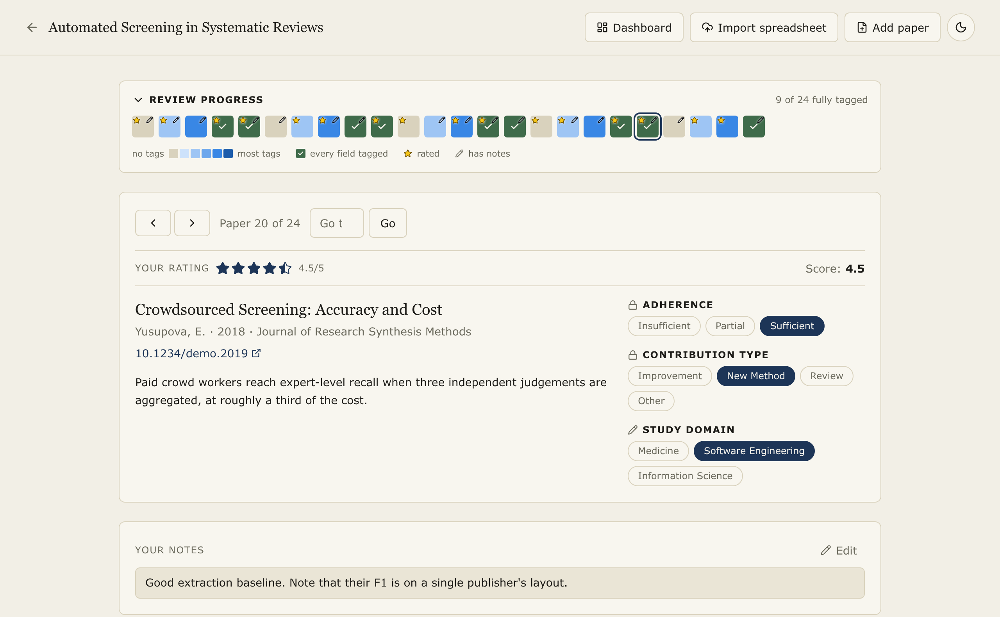
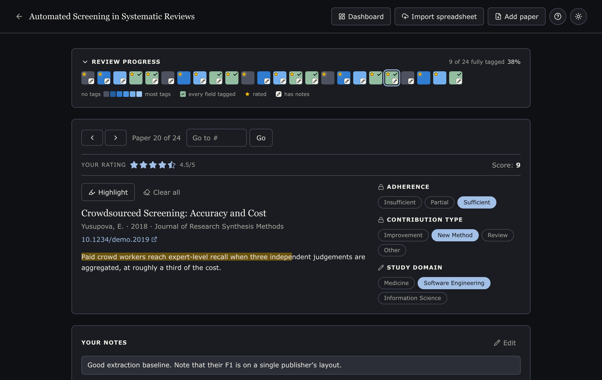

# Literature Review Assistant

A local-first tool for systematic literature reviews: import papers, tag and take notes on them one at a time, and track progress, 
all saved automatically to a local database, with a FastAPI backend and a React frontend.

| Light | Dark |
| :---: | :---: |
| [](docs/screenshots/workspace-light.png) | [](docs/screenshots/workspace-dark.png) |

*The review workspace: the progress overview at the top, then one paper at a time with its rating, tags and notes. The theme follows your system setting and can be toggled in the top right. (The papers shown are fabricated example data.)*

## Overview

This app helps you evaluate and categorize academic papers without juggling spreadsheets and JSON exports by hand. It supports:

- **Multiple review projects**: keep several literature reviews going at once, each with its own papers, tags, and progress.
- **Bulk import** from an Excel export (Scopus, Web of Science, or any sheet with `Title`/`Abstract`/`DOI` columns), with automatic duplicate detection when combining more than one source.
- **Add a single paper by DOI or title**: metadata (title, abstract, authors, year) is fetched automatically from [CrossRef](https://www.crossref.org/), but manual typing is still possible.
- **Real persistence**: everything is saved to a local SQLite database as you work. Close the app, come back later, and you're exactly where you left off. No re-uploading files, no manual export/import to avoid losing progress.
- **Customizable tagging**: two built-in fields (`Adherence`, `Contribution Type`) plus any custom fields/tags you define.
- **Review plan**: a per-review form for why the review exists, what is in scope, how you searched, and what each field and tag means, so the judgements you make on the last paper match the ones you made on the first. What you write about a tag is shown beside it while you tag.
- **Highlighting**: mark passages in a title or abstract with a highlighter; the marks are saved with the paper.
- **Progress overview**: an at-a-glance grid of every paper's review status, click to jump to any paper.

## Architecture

```
literature_review_assistant/
├── backend/                       # FastAPI + SQLModel + SQLite
│   ├── app/
│   │   ├── main.py                # FastAPI app entrypoint
│   │   ├── models.py              # DB schema
│   │   ├── routers/               # API endpoints (projects, papers, fields, import, export)
│   │   └── services/              # dedup logic, CrossRef client, xlsx parsing
│   ├── alembic/                   # DB migrations
│   ├── scripts/migrate_legacy.py  # one-off importer for the old Streamlit app's exports
│   ├── tests/                     # pytest suite
│   └── data/app.db                # local SQLite database (gitignored)
├── frontend/                      # React + TypeScript + Vite + Tailwind CSS
│   └── src/
│       ├── pages/                 # ProjectListPage, ReviewWorkspacePage, DashboardPage
│       ├── components/            # Progress overview, tag panel, import/add-paper modals, etc.
│       ├── hooks/                 # React Query hooks wrapping the API
│       └── api/                   # Typed API client
├── examples/                      # Example .xlsx imports + a description of the format
├── docs/screenshots/              # Images used by this README
├── main.py                        # Cross-platform launcher (backend + frontend together)
└── run.sh, run.cmd                # Thin wrappers around run.py
```

## Requirements

- Python 3.13+
- [uv](https://docs.astral.sh/uv/getting-started/installation/) (manages the backend's Python environment and dependencies)
- Node.js 20+

## Setup (first time)

```bash
# Backend
cd backend
uv sync                        # creates backend/.venv from uv.lock
uv run alembic upgrade head    # creates backend/data/app.db

# Frontend
cd ../frontend
npm install
```

## Running

At project root, using straightforward Python:

```bash
python main.py
```

At project root, using UV:

```bash
uv run main.py
```

Or use the wrapper for your platform: `./run.sh` on macOS/Linux, `run.cmd` on Windows.

This starts the backend at `http://localhost:8000` (API docs at `/docs`) and the frontend at `http://localhost:5173`, then opens the app in your browser. 
**Closing that window stops both servers**, so starting and finishing a session is one action each. 
Ctrl+C in the terminal still works too.

If either default port is already taken (e.g., a second copy of the app, or anything else on 8000/5173), 
the launcher falls forward to the next free port and prints the URLs it actually used.

Use `python main.py --no-browser` or `uv run main.py --no-browser` to start the servers without opening a window. 
They then run until you stop them with Ctrl+C, which is what you want when you are pointing something else at the API.

Or run them separately in two terminals:

```bash
cd backend && uv run uvicorn app.main:app --reload --port 8000
cd frontend && npm run dev
```

## Workflow

1. Create a review project (or open an existing one, they're listed on the home page and persist across restarts).
2. Add papers:
   - **Import a spreadsheet**: click "Import spreadsheet", choose an `.xlsx` file with `Title`/`Abstract` columns (see [`examples/`](examples/) for sample files and the full column list) (`DOI`, `Authors`, `Year`, `Source title` are picked up automatically when present, as in a Scopus export). 
   You'll see a preview flagging likely duplicates (by DOI or title) before anything is saved. 
   Uncheck any you don't want to add.
   - **Add one paper**: click "Add paper" and search by DOI or title (metadata comes from CrossRef automatically) or enter details manually.
3. Review papers one at a time: read the abstract, assign tags, write notes. Everything saves automatically.
4. Use the progress overview grid to jump to any paper and see what's left.
5. Manage tag fields/tags in the "Manage fields and tags" panel. The two built-in fields (`Adherence`, `Contribution Type`) can't be renamed or deleted; custom fields can be freely added, renamed, or removed.

The **?** button in the top right of any screen opens a help page covering the same ground in more detail: what rating and score mean, how a score is calculated, and how to read the progress overview.

Your data lives in `backend/data/app.db`. Back it up like any file if you want an extra copy; the app itself never requires you to export/import it manually.

## Migrating data from the old Streamlit version

If you have an `.xlsx` + session-JSON pair exported from the previous version of this app:

```bash
cd backend
uv run scripts/migrate_legacy.py \
  --xlsx "/path/to/export.xlsx" \
  --json "/path/to/export_session-*.json" \
  --project-name "My Migrated Review"
```

This creates a new project pre-populated with those papers, tags, and notes. It requires the two files to have the same number of rows/entries (they're paired positionally, as the old export format did). It will refuse to run otherwise rather than silently mis-attach tags.

## Contributing

See [CONTRIBUTING.md](CONTRIBUTING.md) for setup, the checks to run before opening a pull request, and how the code is laid out. 
Each half also has its own README: [`backend/`](backend/README.md) and [`frontend/`](frontend/README.md).

## License

See [LICENSE](LICENSE) file for details.
